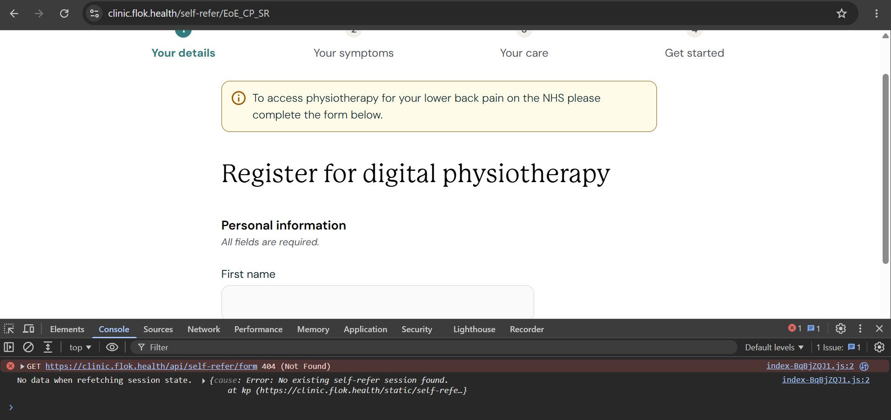
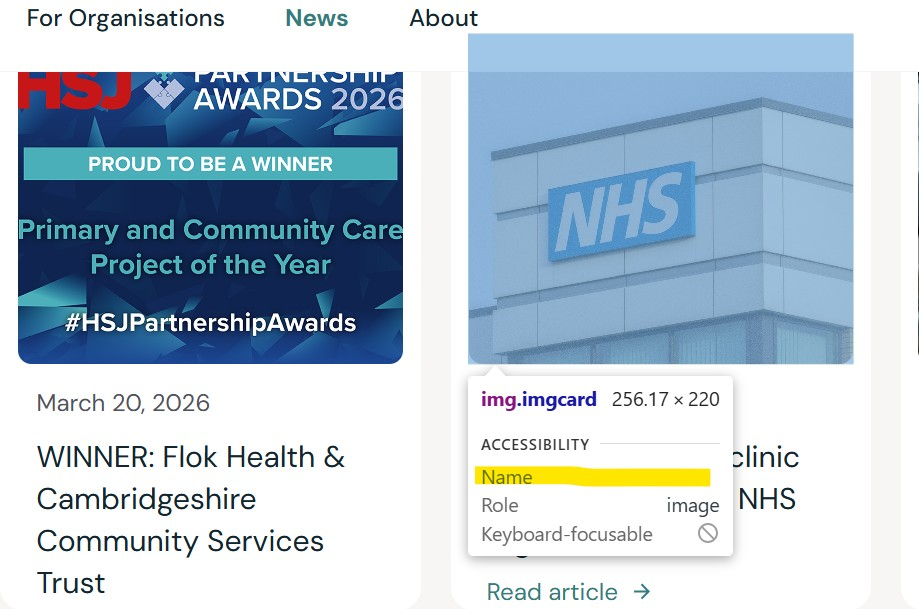
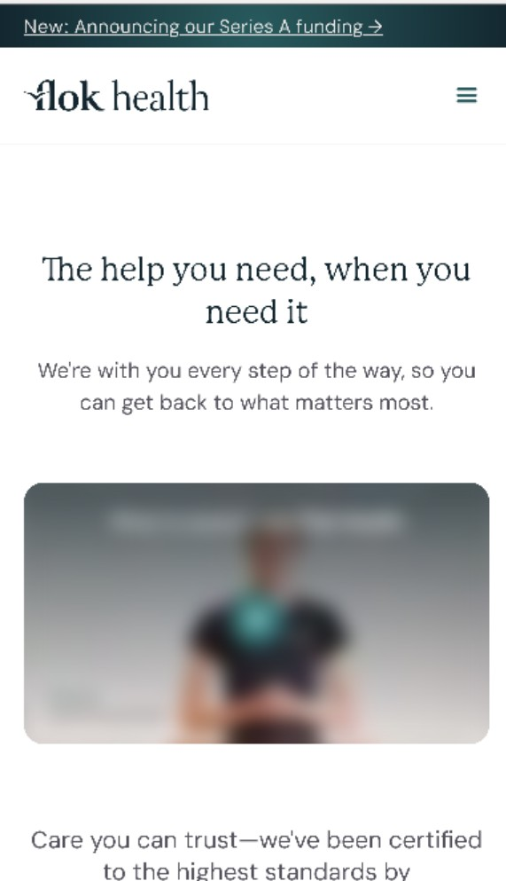

# Playwright Testing for Flok Health's Website

This Playwright automation test framework uses TypeScript to automate [Flok Health](https://www.flok.health/)

## Aim/Goals
- Develop Playwright automation framework using TypeScript.
- Demonstrate use of POM (Page Object Model) to show readable, maintainable and scalable code.
- Create UI tests to verify core webpages are present and functional.
- Create API tests to verify status, save payload and compare against UI.
- Initialise setup tests to run first, confirming environment is ready before running remaining automation tests.
- Perform tests against a variety of web browsers and mobile viewports.
- Integrate CI/CD workflow using GitHub Actions.
- Raise areas of website improvements.
- Development timeboxed to one working week.

## Setup Instructions

Steps on how to install dependencies and execute the tests.

1. Ensure the following are installed:
   - [Node.js](https://nodejs.org/) (v18 or higher)
   - [npm](https://www.npmjs.com/)
   - [Git](https://git-scm.com/)

2. Clone this [repository](https://github.com/pendragon888/FlokHealthWebsite) into your local machine using the terminal (Mac), CMD (Windows), or a GUI tool like SourceTree.

3. Install the node dependencies:

    ```bash
    npm install
    npm install dotenv
    ```
4. To install the playwright browsers:

    ```bash
    npx playwright install
    ```

5. To run all the tests in the directory:

    ```bash
    npx playwright test
    ```


    or to see tests in UI mode
    ```bash
    npx playwright test --ui
    ```

6. To run tests from a specific spec file:

    ```bash
    npx playwright test projects.spec.ts
    ```

## Areas of Interest / Suggested Improvements

### data-testid
- Adding the 'data-testid' HTML attribute to uniquely identified elements in the UI would contribute towards the reliability, maintainance, stability and scalability of the automated tests.

### Browser console-errors

- Two errors are visible when the browser Developer Tools have been opened:

- **_Error updating Webflow analytics: ReferenceError: wf is not defined_**, indicating that the Webflow API is not properly initialised or referenced in the code.


- **_[CONSENTPRO-CORE] [ERROR] Finsweet Consent Pro is not available for production use. Please purchase a plan at https://my.finsweet.com/plans/create/consent-pro_**, indicates a licensing issue for production use.


### Self-Registration

- When visiting the webpage directly (https://clinic.flok.health/self-refer/EoE_CP_SR), a 400 status code error is thrown. This could instead redirect back to the Check Availability page (https://clinic.flok.health/self-refer/coverage)



### Missing alt-text from News images
- Adding alt-text to the images on this particular webpage would help towards accessibility compliance.




### Mobile Safari (iPhone 12)

- When locally running the Mobile Safari test, the Vimeo video player controls are not rendering, hence the test failure. This test helps to identify whether a business criteria needs to be met or that legacy devices don't need to be supported i.e. is the Safari browser on iPhone 12 test a valid scenario?




## Testing Framework Developed By

**Kevin D**

QA Automation Engineer
